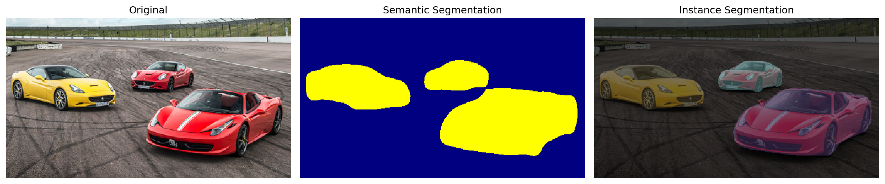
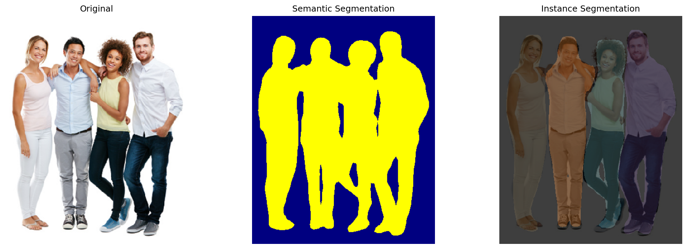

# Image Segmentation Portfolio Project

## Description
This project demonstrates modern semantic and instance image segmentation using PyTorch and torchvision. It features:
- **Semantic Segmentation** (DeepLabV3): Assigns a class label to each pixel.
- **Instance Segmentation** (Mask R-CNN): Detects and segments each object instance separately.
- Aspect ratio is preserved (no image stretching/distortion).
- Modular, clean code structure ready for portfolio and GitHub.

---

## Project Structure
```
Task5/
├── images/               # Example input images
│   ├── image1.jpg
│   ├── image2.jpg
│   └── image3.jpg
├── results/              # Segmentation results (auto-created)
├── main.py               # Main entry point
├── segmentation.py       # Segmentation logic (semantic/instance)
├── utils.py              # Utilities (seed, logging)
├── config.py             # All settings and paths
├── requirements.txt      # Dependencies
├── .gitignore            # Git exclusions
└── README.md             # Documentation (this file)
```

---

## Quick Start
1. **Install dependencies:**
   ```bash
   pip install -r requirements.txt
   ```
2. **Put your images in the `images/` folder** (or use the provided examples).
3. **Run the segmentation:**
   ```bash
   python main.py
   ```
   Or for a single image:
   ```bash
   python main.py images/your_image.jpg
   ```
4. **Results** will appear in the `results/` folder.

---

## Results

Below are example segmentation results produced by the project. Each image shows the output for a different input (semantic or instance segmentation):

| Example Output Results |
|-----------------------|
|    |

---

## Theory (Short)
- **Semantic Segmentation:** Assigns a class to every pixel (e.g., "car", "cat"). Uses DeepLabV3 from torchvision.
- **Instance Segmentation:** Detects and segments each object instance. Uses Mask R-CNN from torchvision.

---

## Customization
- All parameters (paths, size, thresholds) are in `config.py`.
- Add your own images to `images/` and list them in `DATA_IMAGES`.

---

## License
MIT. Free to use and modify.

---

**Author:** Bobur

---

*Feel free to open issues or contribute!*
